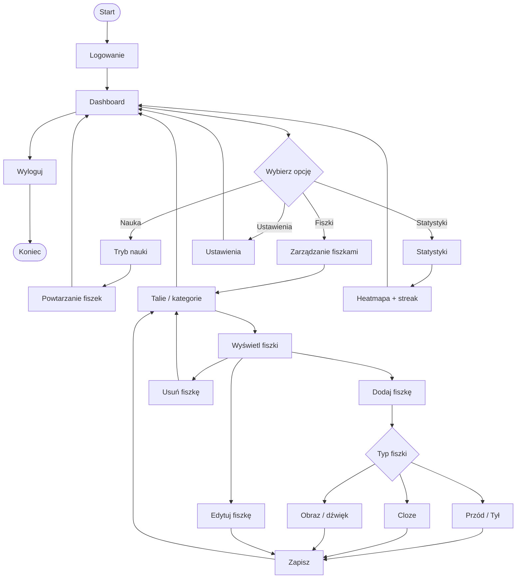

```mermaid
    flowchart TD
        Start([Start])
        End([Koniec])

        Start --> Login[Logowanie]
        Login --> Dashboard[Dashboard]

        Dashboard --> Choose{Wybierz opcję}


        Choose -->|Nauka| Learn[Tryb nauki]
        Learn --> Cards[Powtarzanie fiszek]
        Cards --> Dashboard


        Choose -->|Fiszki| Flashcards[Zarządzanie fiszkami]

        Flashcards --> Decks[Talie / kategorie]
        Decks --> View[Wyświetl fiszki]
        View --> Add[Dodaj fiszkę]
        View --> Edit[Edytuj fiszkę]
        View --> Delete[Usuń fiszkę]

        Add --> Type{Typ fiszki}
        Type --> FrontBack[Przód / Tył]
        Type --> Cloze[Cloze]
        Type --> Media[Obraz / dźwięk]
        FrontBack --> Save[Zapisz]
        Cloze --> Save
        Media --> Save

        Edit --> Save
        Delete --> Decks
        Save --> Decks

        Decks --> Dashboard


        Choose -->|Statystyki| Stats[Statystyki]
        Stats --> Heatmap[Heatmapa + streak]
        Heatmap --> Dashboard


        Choose -->|Ustawienia| Settings[Ustawienia]
        Settings --> Dashboard

        Dashboard --> Logout[Wyloguj]
        Logout --> End
```